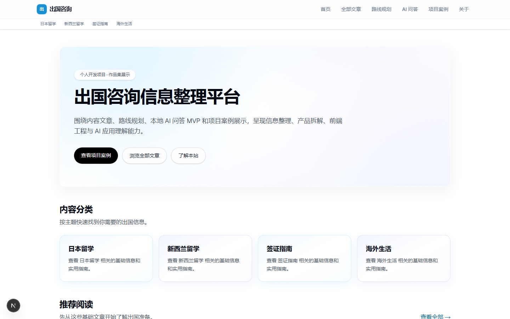
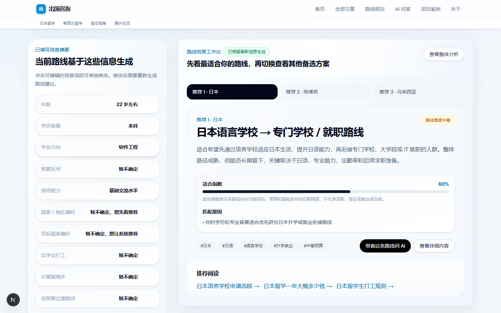
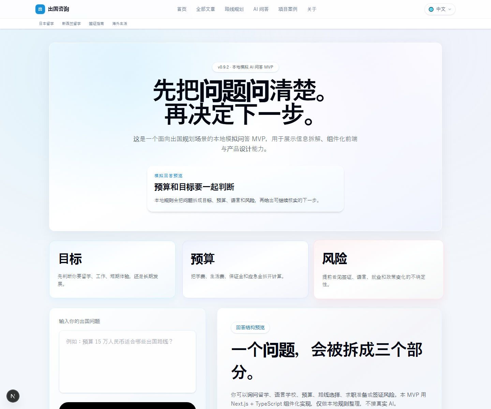
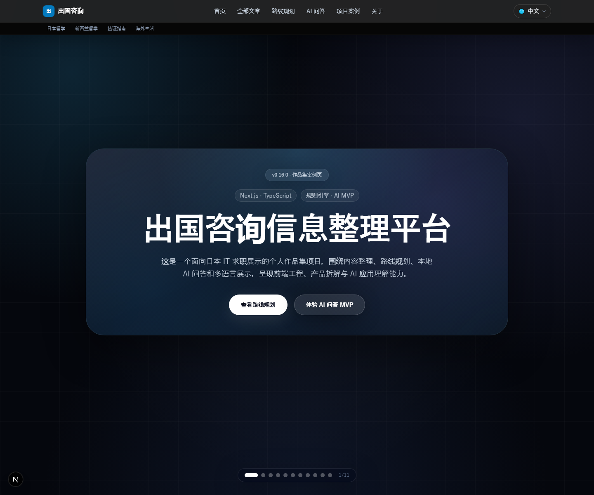

# 出国咨询信息整理平台

这是一个个人开发的出国信息整理与路线规划项目，用于展示内容组织、路线规划、本地 AI 问答 MVP、组件化前端工程和作品集级 UI 设计能力。

**当前版本：** v0.13.0  
**当前定位：** 个人作品集项目 / 日本 IT 求职展示项目

---

## English Summary

This is a personal portfolio project for organizing study-abroad information, route planning, and a local AI Q&A MVP. It demonstrates frontend engineering, product thinking, rule-based logic, UI design, and clear AI application boundaries.

---

## 日本語概要

本プロジェクトは、留学・海外生活に関する情報整理、進路プランニング、ローカル AI 問答 MVP を含む個人ポートフォリオです。Next.js、React、TypeScript、Tailwind CSS を用いて、フロントエンド実装力、プロダクト設計、ルールベースのロジック、UI 設計、AI 活用の境界設計を示すことを目的としています。

---

## 多语言展示

v0.13.0 增强 `/case-study` 面试展示：面试官快速查看、技术决策、开发者职责说明；README 增加面试官阅读路径。v0.12.4 完成文章数据三语言化（标题、摘要、正文、分类、阅读时间），修复 `/`、`/articles`、`/about`、`/articles/[slug]` 背景非全屏问题，统一文章列表、分类页与详情页视觉。当前多语言覆盖导航、页面 UI、文章卡片与详情页；语言选择通过 localStorage 记住，不改变 URL。

---

## 面试官快速查看

面向日本 IT 求职场景，建议按以下路径浏览项目：

- **在线项目**：访问 [首页](https://study-abroad-consulting.vercel.app/) 与 [/case-study](https://study-abroad-consulting.vercel.app/case-study)
- **核心功能**：[/plan](https://study-abroad-consulting.vercel.app/plan) 路线规划、[/ai](https://study-abroad-consulting.vercel.app/ai) 本地问答 MVP、[/articles](https://study-abroad-consulting.vercel.app/articles) 内容文章
- **工程亮点**：`lib/plan` 规则引擎、`lib/ai` mock 逻辑、`lib/i18n` 多语言、`lib/ui/card-system.ts` 设计系统
- **项目说明**：[docs/project-status.md](./docs/project-status.md)
- **当前边界**：不接真实 AI、不接数据库、不做登录和付费

---

## 面试讲解文档

- [docs/interview-guide.md](./docs/interview-guide.md) — 中日英项目介绍、技术决策、架构说明、面试 Q&A 与演示路线

---

## 技术决策摘要

- **先用本地规则引擎验证流程**：/plan 用 TypeScript 本地逻辑验证匹配与交互，比先搭数据库更快迭代、更易讲解
- **AI 页面先做 mock MVP，明确边界**：不接真实 API，固定回答结构，展示产品原型与边界意识
- **多语言优先服务作品集展示**：中文 / 日本語 / English 便于日本求职面试演示
- **UI 系统围绕 Apple 风格做统一 token**：`card-system` 统一卡片、按钮、渐变与页面背景

---

## 在线访问

[https://study-abroad-consulting.vercel.app](https://study-abroad-consulting.vercel.app)

---

## 项目截图

以下截图展示了项目的主要页面，包括首页、路线规划、本地 AI 问答 MVP 和作品集案例页。

### 首页



首页展示项目定位、内容分类和推荐阅读入口。

### 路线规划



路线规划页展示基于本地规则的出国路线推荐流程。

### AI 问答 MVP



AI 问答页展示本地模拟问答 MVP 与问题拆解能力。

### 项目案例页



项目案例页展示项目背景、技术栈、架构和工程亮点。

---

## 项目背景

很多准备出国的用户会同时面对国家选择、预算、语言、签证、学校、就业方向等问题，信息分散且容易焦虑。本项目尝试把这些信息拆成结构化页面、路线规划流程和本地问答 MVP，帮助用户先把问题问清楚，再决定下一步。

---

## 核心功能

- **内容文章系统**：文章列表、分类、详情、搜索筛选
- **/plan 路线规划**：基于预算、语言、目标、风险的本地规则推荐
- **/ai 本地问答 MVP**：将出国问题拆成目标、预算、语言、风险和下一步
- **/case-study 项目案例页**：展示项目背景、技术栈、架构、工程亮点和后续计划
- **响应式 UI**：适配桌面端和移动端
- **Vercel 在线部署**

---

## 技术栈

- Next.js 16
- React
- TypeScript
- Tailwind CSS
- Git / GitHub
- Vercel

---

## 项目结构

```text
app/
  page.tsx
  articles/
  categories/
  plan/
  ai/
  case-study/

components/
  ai/
  plan/
  ArticleCard.tsx
  Navbar.tsx
  Footer.tsx

lib/
  ai/
  plan/
  ui/

docs/
  project-status.md
```

---

## 工程亮点

- **页面与业务逻辑分离**：页面负责组合与展示，业务规则下沉到 `lib/*`
- **/plan 规则引擎抽离**：推荐、评分、分析文案位于 `lib/plan`（如 `route-engine`、`scoring-engine`、`insight-engine`）
- **/ai 边界清晰**：当前为本地 mock，不伪装真实 AI，便于展示产品原型与信息架构
- **统一设计系统**：`lib/ui/card-system.ts` 维护卡片、按钮、标签与页面视觉 token
- **逐步迭代**：从内容网站 MVP → 路线规划 → AI 问答 → 作品集展示页
- **版本管理与部署**：GitHub 管理代码，Vercel 持续部署线上环境

---

## AI MVP 边界

当前 `/ai` 页面**不接真实 AI API**，**不保存历史记录**，**不提供**签证、移民、录取、就业承诺。它主要用于展示 AI 产品原型设计、信息拆解和交互流程能力。

---

## 本地运行

```bash
npm install
npm run dev
npm run build
npm run lint
```

开发环境默认访问 [http://localhost:3000](http://localhost:3000)。若 3000 端口被占用，Next.js 可能会自动使用 3001。

---

## 页面入口

| 页面 | 路径 |
|------|------|
| 首页 | `/` |
| 全部文章 | `/articles` |
| 路线规划 | `/plan` |
| AI 问答 | `/ai` |
| 项目案例 | `/case-study` |
| 关于 | `/about` |

---

## 后续计划

- 补充更多真实案例内容
- 增强 `/plan` 与 `/ai` 的上下文联动
- 接入真实 AI API 前先设计安全边界
- 增加更完整的错误状态和测试
- 后续补充英文或日文版本，用于日本求职展示

---

## 项目声明

本项目为**个人作品集项目**，内容仅作信息整理和功能展示，不构成签证、移民、录取、就业或法律建议。重要信息应以学校、使领馆、入管局和官方政策为准。

---

## 相关文档

- 项目状态与版本记录：[docs/project-status.md](docs/project-status.md)
